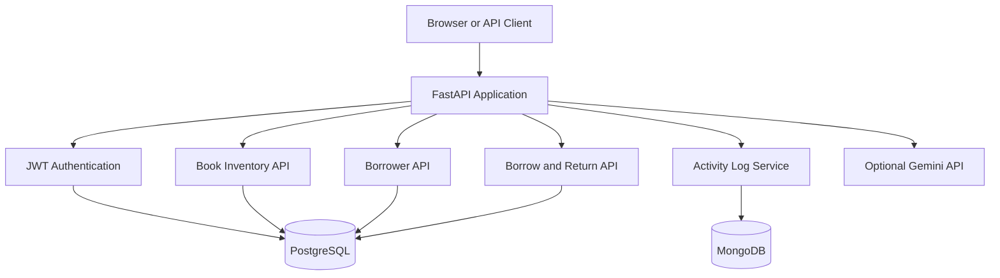
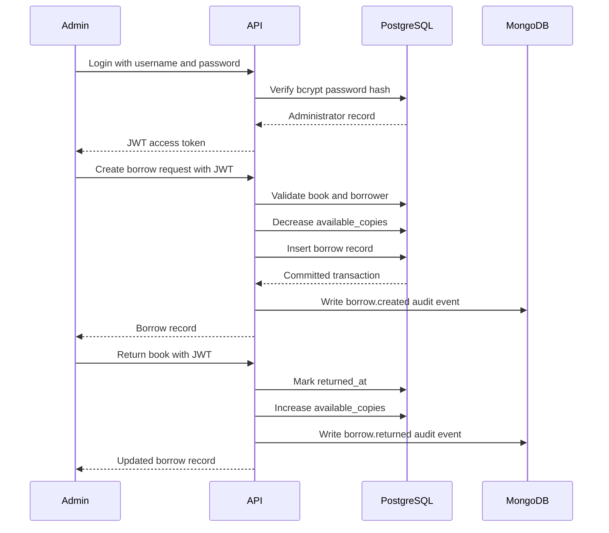

# Book Borrowing System Overview

## 1. Purpose

The Book Borrowing System is a FastAPI backend for managing library administrators, book inventory, borrowers, and borrowing transactions. It uses PostgreSQL for transactional data, MongoDB for administrator activity logs, JWT for API authentication, and an optional Gemini integration for AI-assisted text generation.

## 2. High-Level Architecture



## 3. Main Components

### FastAPI application

The application entry point is `app/main.py`. It configures the application lifespan, mounts static assets, registers API routers, and exposes the dashboard and OpenAPI documentation.

Important endpoints:

- `GET /health`: service health check
- `GET /docs`: interactive Swagger documentation
- `POST /api/auth/register`: create an administrator
- `POST /api/auth/login`: issue a JWT access token
- `POST /api/auth/token`: OAuth2-compatible token endpoint
- `GET /api/books`: list books
- `POST /api/books`: create a book
- `GET /api/borrowers`: list borrowers
- `POST /api/borrowers`: create a borrower
- `GET /api/borrows`: list borrowing records
- `POST /api/borrows`: record a borrowing transaction
- `POST /api/borrows/{borrow_id}/return`: return a borrowed book
- `GET /api/logs`: list recent administrator activity logs
- `POST /api/ai/generate`: generate text with Gemini when configured

### PostgreSQL database

PostgreSQL stores data that requires relational integrity and transactional consistency:

- `admin_users`: administrator credentials and account status
- `books`: ISBN, title, author, total copies, and available copies
- `borrowers`: borrower identity and contact information
- `borrows`: book loans, due dates, and return timestamps

SQLAlchemy AsyncEngine and AsyncSession provide asynchronous database access. Alembic manages schema migrations.

### MongoDB activity logging

MongoDB stores flexible audit events in the configured activity-log collection. Events include:

- administrator registration
- administrator login
- borrowing transactions
- book returns

Audit logging is deliberately non-blocking: a MongoDB outage should not roll back a successful PostgreSQL business transaction.

### JWT authentication

Authentication flow:

1. An administrator registers or logs in.
2. The API verifies the password hash.
3. The API returns a signed JWT access token.
4. Protected endpoints require `Authorization: Bearer <token>`.
5. The dependency in `app/api/deps.py` decodes the token and identifies the administrator.

Passwords are stored as bcrypt hashes and are never stored in plaintext.

### Optional Gemini integration

Gemini is optional and isolated from the core borrowing workflow. Configure it with:

```env
GEMINI_API_KEY=your-api-key
GEMINI_MODEL=gemini-2.5-flash
```

Without `GEMINI_API_KEY`, the rest of the system remains usable and the AI endpoint returns a clear service-unavailable response.

## 4. Borrowing Workflow



## 5. Project Structure

```text
starter_project/
├── app/
│   ├── api/
│   │   ├── deps.py
│   │   └── routes/
│   │       ├── auth.py
│   │       ├── books.py
│   │       ├── borrowers.py
│   │       ├── borrows.py
│   │       ├── logs.py
│   │       └── health.py
│   ├── core/
│   │   └── config.py
│   ├── db/
│   │   ├── base.py
│   │   ├── mongo.py
│   │   └── postgres.py
│   ├── models/
│   │   ├── user.py
│   │   ├── book.py
│   │   ├── borrower.py
│   │   └── borrow.py
│   ├── schemas/
│   │   ├── auth.py
│   │   ├── books.py
│   │   ├── borrowers.py
│   │   └── borrows.py
│   ├── services/
│   │   ├── audit_service.py
│   │   └── ai_service.py
│   ├── templates/
│   └── main.py
├── alembic/
│   ├── env.py
│   └── versions/
├── .env.example
├── alembic.ini
├── main.py
├── pyproject.toml
├── requirements.txt
└── SYSTEM_OVERVIEW.md
```

## 6. Data Ownership Rules

| Concern | PostgreSQL | MongoDB |
|---|---:|---:|
| Administrator accounts | Yes | No |
| Password hashes | Yes | No |
| Books and inventory | Yes | No |
| Borrowers | Yes | No |
| Borrow transactions | Yes | No |
| Activity/audit events | No | Yes |
| AI request traces | Optional | Recommended |

PostgreSQL is the source of truth for inventory and borrowing state. MongoDB is an append-oriented store for logs and flexible event data.

## 7. Startup and Deployment

Local startup:

```powershell
cd C:\Users\jumsa\Documents\book-borrowing\starter_project
.\.venv\Scripts\Activate.ps1
alembic upgrade head
uvicorn app.main:app --host 127.0.0.1 --port 8000
```

Local URLs:

- Application: http://127.0.0.1:8000/
- API documentation: http://127.0.0.1:8000/docs
- Health check: http://127.0.0.1:8000/health

Required infrastructure:

- PostgreSQL running and reachable through `DATABASE_URL`
- MongoDB running and reachable through `MONGO_URI`
- `JWT_SECRET_KEY` configured with a strong secret
- `GEMINI_API_KEY` only when AI functionality is needed

## 8. Security Boundaries

- Use HTTPS outside local development.
- Replace all development secrets before deployment.
- Keep `.env` out of source control.
- Use a strong, rotated JWT signing key.
- Apply database least-privilege credentials.
- Validate all request bodies with Pydantic schemas.
- Keep audit records free of passwords, access tokens, and other secrets.
- Add rate limiting and account lockout before exposing authentication publicly.

## 9. Known Operational Behavior

The application attempts PostgreSQL and MongoDB startup checks during FastAPI lifespan initialization. It logs connection failures rather than preventing the process from starting. This makes the API shell available during local development, but production deployments should add explicit readiness checks and fail deployment health checks when required infrastructure is unavailable.
